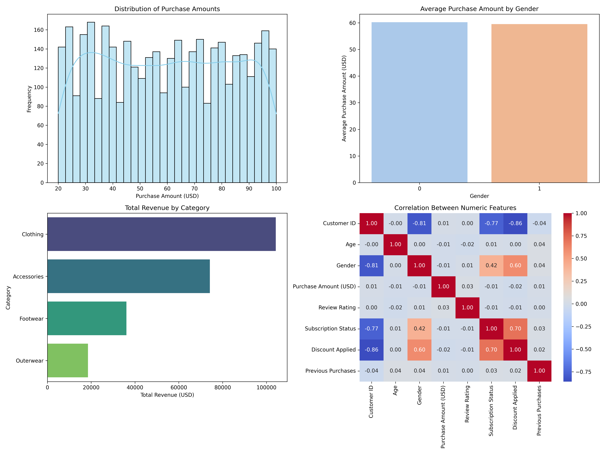

<<<<<<< HEAD
- Maryam Mohamed
- Sara Mostafa
- Salma Awad
- Abdulla khalid

docker build -t customer-analytics .
docker run -it --name customer_container customer-analytics
docker start customer_container
docker exec -it customer_container python ingest.py shopping_trends.csv

python ingest.py shopping_trends.csv (local)

ingest.py → preprocess.py → analytics.py → visualize.py → cluster.py

- data_raw.csv
- data_preprocessed.csv
- insight1.txt
- insight2.txt
- insight3.txt
- summary_plot.png
- clusters.txt

Github link: https://github.com/sara-787/customer_analytics

